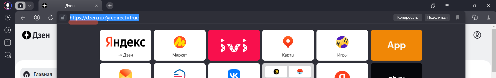

# Урок 2. Семинар. Веб-технологии: вчера, сегодня, завтра
## На основе сайта [yandex.ru:](https://dzen.ru/?yredirect=true)

1. Определите, на каком протоколе работает сайт.
2. Проанализируйте структуру страницы сайта
3. Внесите не менее 10 изменений на страницу с помощью инструмента разработчика и представьте скриншоты было/стало.    
4. Создайте прототип низкой детализации.

# 1. Определите, на каком протоколе работает сайт
>Ответ: Сайт работает по протоколу HTTPS. Сертификат действителен: 07.06.2025г

# 2. Проанализируйте структуру страницы сайта
 

# 3. Внесите не менее 10 изменений на страницу с помощью инструмента разработчика и представьте скриншоты было/стало.   

## Было

## Стало

# 4. Создайте прототип низкой детализации.
 